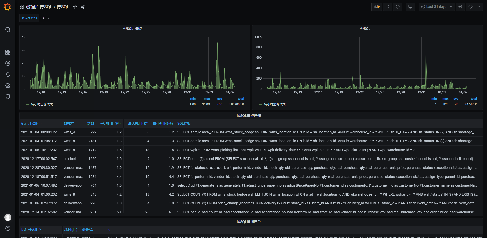
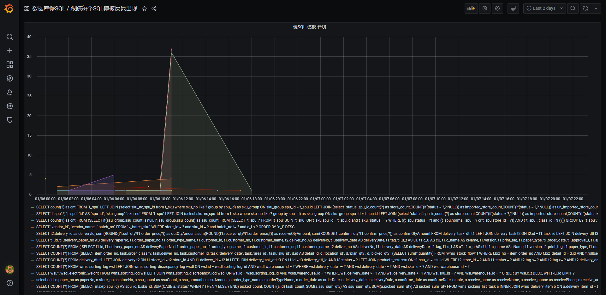

# executor-sync-polardb-slow-log
执行者-同步polardb慢SQL

# 开发

```

pip install aliyun-python-sdk-core

pip install aliyun-python-sdk-polardb

pip install PyYAML

pip install apscheduler


pip freeze > requirements.txt


```

# 部署

如果没有数据库则需要部署部署(mysql8)

并且参考deploy/db_scripts/table_struct.sql初始化表结构

```
echo "清理原来的mysql容器"
docker stop mymysql
docker rm   mymysql

echo "拉取docker镜像"
docker pull mysql:8.0.22

echo "准备文件夹"
rm -rf /data/tristan/mysql/data
mkdir -p /data/tristan/mysql/data

echo "准备binlog"
sudo tee /data/tristan/mysql/mysql.cnf <<-'EOF'
[mysql]
[mysqld]
log-bin=binlog
server-id=1
sql_mode=STRICT_TRANS_TABLES,NO_ZERO_IN_DATE,NO_ZERO_DATE,ERROR_FOR_DIVISION_BY_ZERO,NO_ENGINE_SUBSTITUTION
EOF
chmod 644 /data/tristan/mysql/mysql.cnf

echo "运行mysql容器"
docker run --name  mymysql -p 3306:3306 --restart=always --privileged=true \
    -v /etc/localtime:/etc/localtime:ro \
    -v /data/tristan/mysql/mysql.cnf:/etc/mysql/conf.d/mysql.cnf \
    -v /data/tristan/mysql/data:/var/lib/mysql \
    -e TZ=Asia/Shanghai \
    -e MYSQL_ROOT_PASSWORD=tristan123 \
    -e MYSQL_DATABASE=tristan \
    -e MYSQL_USER=tristan \
    -e MYSQL_PASSWORD=tristan123 \
    -d mysql:8.0.22  \
    --character-set-server=utf8mb4  \
    --collation-server=utf8mb4_unicode_ci

echo "查看容器运行情况"
docker ps|grep mymysql

sleep 3;
echo "查看日志"
docker logs -f --tail 100 mymysql

```

部署项目

```
docker stop executor-sync-polardb-slow-log
docker rm executor-sync-polardb-slow-log
docker rmi tanshilindocker/laasops

mkdir -p /data/tristan/soa/executor-sync-polardb-slow-log/config && chmod 777 /data/tristan/soa/executor-sync-polardb-slow-log/config

docker run -d --restart=always --name executor-sync-polardb-slow-log \
  -v /data/tristan/soa/executor-sync-polardb-slow-log/config:/usr/src/app/configs \
  laashubsoa/executor-sync-polardb-slow-log

docker logs -f --tail 100 executor-sync-polardb-slow-log

docker exec -it executor-sync-polardb-slow-log bash
```

# dashboard

参考dashboard目录的json文件

导入之前需要创建mysql数据源(建议不要使用root账号)

效果图




